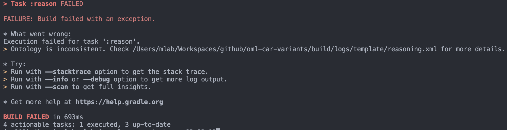
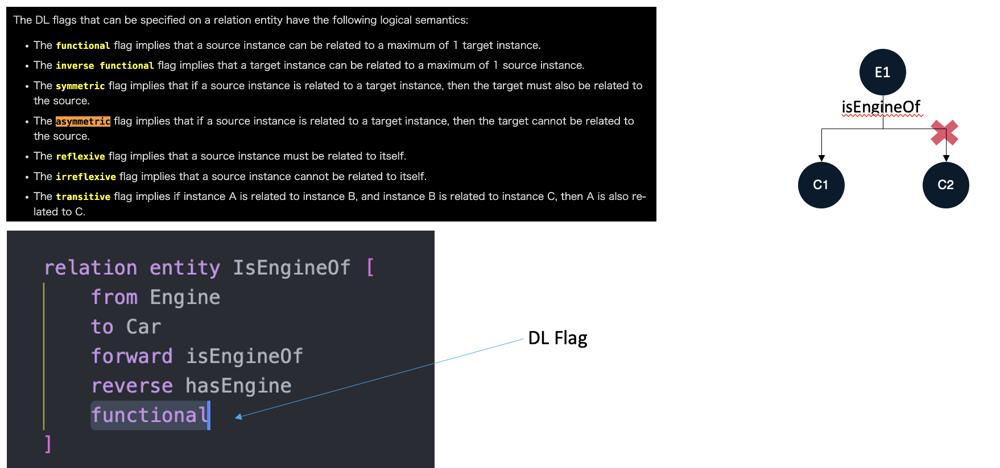

# OML Template

[](https://github.com/opencaesar/oml-template/actions/workflows/ci.yml)
[](https://github.com/opencaesar/oml-template/releases/latest)
[](https://www.opencaesar.io/oml-template/) 

This repository has a template [OML](https://github.com/opencaesar/oml) project. It is meant to be forked as a starting point by pressing the 'Use this template' button above.

> this template is suitable for use with OML Rosetta and OML Luxor (but not OML Vision)

## Clone
```
  git clone https://github.com/UTNAK/oml-imce-vocabulary.git
  cd oml-imce-vocabulary
```

## Build

Check the consistency of the dataset

```
./gradlew build
```

## Generate Docs

Generate documentation from dataset

```
./gradlew generateDocs
```

## Start Fuseki Server

Start the Fuseki triple store

```
./gradlew startFuseki
```

Navigate to http://localhost:3030

Verify you see a dataset: `template`

## Stop Fuseki Server

Stop the Fuseki triple store

```
./gradlew stopFuseki
```

## Load Dataset to Fuseki

Load the dataset to Fuseki server

```
./gradlew load
```

Navigate to http://localhost:3030/#/dataset/template/info

Click on `count triples in all graphs` and observe the triple counts

## Run SPARQL Queries

Run the SPARQL queries

```
./gradlew query
```

Inspect the results at `build/results/template`

## Run SHACL Rules
Run the SHACL rules

```
./gradlew validate
```

Inspect the results at `build/logs/template`

## Publish to Maven Local

Publish the OML dataset as an archive in the local maven repo

```
./gradlew publishToMavenLocal
```

Inspect the OML archive

```
ls ~/.m2/repository/io/opencaesar/oml-template
```

## Customize Template

The name of this project is `oml-template`. You can change it to your own project name. The easiest way to do this is to look for the word `template` in this repo and replace it. The files that need to be changes include:

- `.project` (name)
- `.catalog.xml` (first rewriteURI)
- `README.md` (various places)
- `.oml/fuseki.ttl` (fuseki:name)
- `.oml/oml.yml` (various places)
- `src/oml/*` (namespaces of ontologies)
- `src/sparcl/*` (namespaces of ontologies)
- `src/shacl/*` (namespaces of ontologies)


# Experiment #1 : Query and Visualize using Quarto Notebook

1. `R --version`
2. `quarto -V`
3. `./gradlew build`
4. `./gradlew load`
5. `./gradlew query`
6. Then you can find a file of `build/results/template/objective.json`
7. Open `/oml-car-variants/script/objective_report.qmd`
8. `quarto render script/objective_report.qmd
9. Then you will get the `script/objective_report.html`
10. Open in browser


# Experiment #2

## Query 1: Get All the Car

```sparql
PREFIX rdf: <http://www.w3.org/1999/02/22-rdf-syntax-ns#>
PREFIX base:        <http://imce.jpl.nasa.gov/foundation/base#>
PREFIX vocabulary1:        <http://opencaesar.io/template/vocabulary/vocabulary1#>
PREFIX owl: <http://www.w3.org/2002/07/owl#>
PREFIX vim4: <http://bipm.org/jcgm/vim4#>

SELECT DISTINCT*
WHERE {
	?iri a vocabulary1:Car;
  		vocabulary1:hasEngine [
      		vocabulary1:hasDisplacement [
        		vim4:hasDoubleNumber ?displacement
    	]
	]
}ORDER BY ?iri
```

## Query 2: Get All the CX-8

```sparql
PREFIX rdf: <http://www.w3.org/1999/02/22-rdf-syntax-ns#>
PREFIX base:        <http://imce.jpl.nasa.gov/foundation/base#>
PREFIX vocabulary1:        <http://opencaesar.io/template/vocabulary/vocabulary1#>
PREFIX owl: <http://www.w3.org/2002/07/owl#>
PREFIX vim4: <http://bipm.org/jcgm/vim4#>

SELECT DISTINCT*
WHERE {
	?iri a vocabulary1:CX-8;
  		vocabulary1:hasEngine [
      		vocabulary1:hasDisplacement [
        		vim4:hasDoubleNumber ?displacement
    	]
	]
}ORDER BY ?iri
```


# Reasoner Test

Change `descrpition1.oml` as follows,

```oml
	instance kens-CX-8 : vocabulary1:CX-8 [
		vocabulary1:hasEngine kens-SR14-v1
	]

	instance bobs-CX-9 : vocabulary1:CX-9 [
		vocabulary1:hasEngine kens-SR14-v1
	]
```

Then run `./gradlew build`.

You may get a response like this,



Open `/oml-car-variants/build/logs/template/reasoning.xml`.
You can find the error of `An individual contains a minCardinality restriction that is greater than a maxCardinality restriction`.

This error says the same `Engine` cannot become `isEngineOf` in more than one `Car`.

