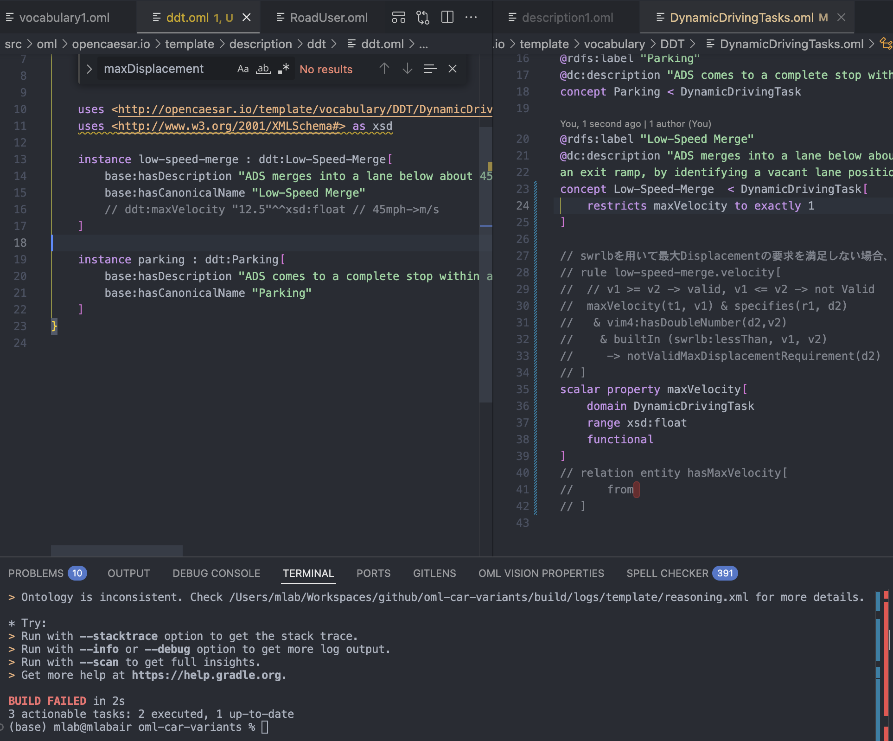

# Scenario Validation Using Reasoner

OWL2 DL Reasonerを使って、自動運転の検証シナリオのパラメーター設定の妥当性を検証する方法を提案する。

## シナリオの設定パラメーターの抜け漏れチェック

これは、vocabularyに [Property Value Restriction Axiom](https://www.opencaesar.io/oml/#PropertyValueRestrictionAxiom-LR)を付与することで、あるinstanceは必ずXXというパラメーターを定義する必要がある、という制約を与えることができる。これにより、descriptionを記述した際に、必要なパラメーターの定義漏れをReasonerで検出できる。





## Not Valid Velocityの抽出 (rule + swrl)

`builtIn ( swrlb:lessThan, vmax, value) -> NotValidVel(vel)`

value should be less than vmax.
vmax < value => NotValidVel(vel)


```oml
	rule low-speed-merge-velocity[
        maxVelocity(ddt, vmax) &
         adsdomain:isPerformedBy(ddt, ads) &
          adsdomain:isEquippedTo(ads, sv) & 
           adsdomain:hasVelocity(sv, vel) &
            adsdomain:hasFloatNumber(vel, value) &
             builtIn ( swrlb:lessThan, vmax, value) -> NotValidVel(vel)
    ]
```

## NotValidReq抽出

```sparql
PREFIX rdf: <http://www.w3.org/1999/02/22-rdf-syntax-ns#>
PREFIX dc: <http://purl.org/dc/elements/1.1/>
PREFIX owl: <http://www.w3.org/2002/07/owl#>
PREFIX ad: <http://schemas.talis.com/2005/address/schema#>
PREFIX analysis:  <http://imce.jpl.nasa.gov/foundation/analysis#>
PREFIX constraint: <http://opencaesar.io/firesat-telecom/telecom-supplier/vocabulary/constraint#>
PREFIX rdfs:      <http://www.w3.org/2000/01/rdf-schema#>
PREFIX ads:       <http://opencaesar.io/template/vocabulary/ADSdomain#>
PREFIX ec:        <http://opencaesar.io/template/vocabulary/EnverionmentalCondition/EnverionmentalCondition#>
PREFIX ddt: <http://opencaesar.io/template/vocabulary/DDT/DynamicDrivingTasks#>

SELECT DISTINCT* #?odd ?oe ?iri ?weatherPattern
WHERE {
  ?sv_vel a ddt:NotValidVel;
			ads:hasFloatNumber ?vel;
   			ads:isVelocityOf ?sv;
    OPTIONAL{
        ?test ads:hasAV ?sv
    }
  
  
#    ?ddttask ddt:maxVelocity ?v;
#             ads:isPerformedBy [ ads:isEquippedTo [ads:hasVelocity[ ads:hasFloatNumber ?vel]]];
#  			ddt:maxVelocity ?v;
}
ORDER BY ?odd ?oe
```

## ルールを使わずにクエリ

```SPARQL
PREFIX rdf: <http://www.w3.org/1999/02/22-rdf-syntax-ns#>
PREFIX dc: <http://purl.org/dc/elements/1.1/>
PREFIX owl: <http://www.w3.org/2002/07/owl#>
PREFIX ad: <http://schemas.talis.com/2005/address/schema#>
PREFIX analysis:  <http://imce.jpl.nasa.gov/foundation/analysis#>
PREFIX constraint: <http://opencaesar.io/firesat-telecom/telecom-supplier/vocabulary/constraint#>
PREFIX rdfs:      <http://www.w3.org/2000/01/rdf-schema#>
PREFIX ads:       <http://opencaesar.io/template/vocabulary/ADSdomain#>
PREFIX ec:        <http://opencaesar.io/template/vocabulary/EnverionmentalCondition/EnverionmentalCondition#>
PREFIX ddt: <http://opencaesar.io/template/vocabulary/DDT/DynamicDrivingTasks#>

SELECT DISTINCT* #?odd ?oe ?iri ?weatherPattern
WHERE {
    ?ddttask ddt:maxVelocity ?v;
             ads:isPerformedBy [ ads:isEquippedTo [ads:hasVelocity[ ads:hasFloatNumber ?vel]]];
#  			ddt:maxVelocity ?v;
    BIND(IF(?v <= ?vel, "NG", "OK") AS ?result)
}
ORDER BY ?odd ?oe
```